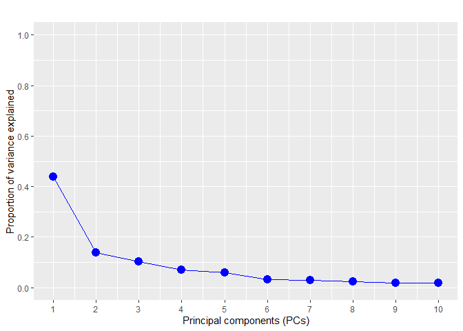
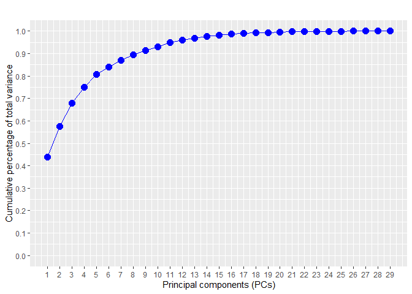
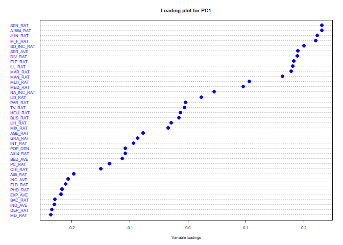
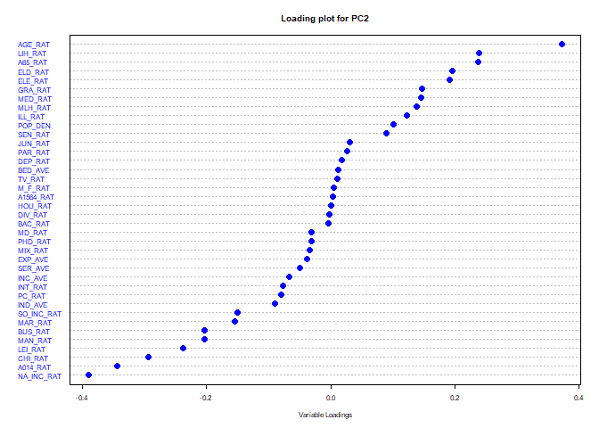
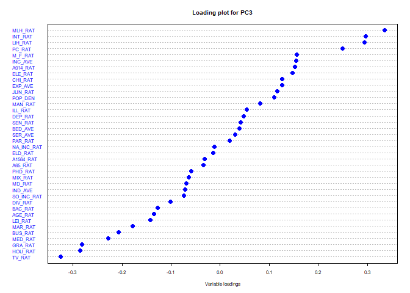
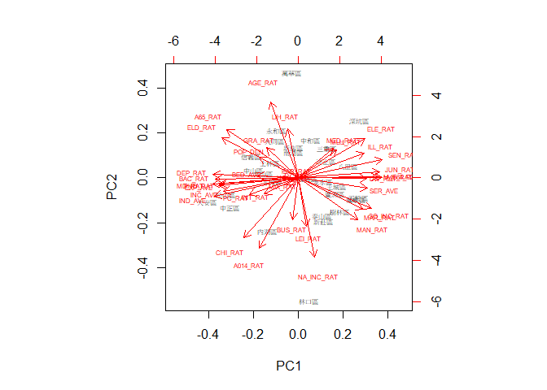

社會經濟資料處理與主成分分析分享
================
江偉銘
25 November, 2022

## 資料載入與整理

You can include R code in the document as follows:

``` r
factors <- read.csv(file = "socioeconomic_factors.csv")
factors <- factors[factors$POP_DEN > 1000, ]
fac_df <- factors[,-1:-3]
row.names(fac_df) <- factors[,2]
head(fac_df)
```

    ##         POP_DEN A014_RAT A1564_RAT  A65_RAT M_F_RAT DEP_RAT CHI_RAT ELD_RAT
    ## 松山區 21331.21 14.73804  65.64910 20.72128   87.68   54.41   22.42   31.99
    ## 信義區 18908.43 11.71338  68.88354 20.96971   90.39   47.81   16.79   31.01
    ## 大安區 26307.59 15.38052  64.11702 21.75810   87.12   58.34   24.01   34.33
    ## 中山區 16148.40 12.16462  68.86677 20.29564   86.31   47.54   17.55   29.99
    ## 中正區 20257.13 16.38697  65.09624 19.35976   90.69   55.37   25.25   30.13
    ## 大同區 21664.17 12.86916  68.26015 19.49141   93.90   47.75   18.83   28.92
    ##        AGE_RAT NA_INC_RAT SO_INC_RAT MAR_RAT DIV_RAT   PHD_RAT    MD_RAT
    ## 松山區  142.72      -0.12      -6.42    0.93    0.32 1.4425601 12.437916
    ## 信義區  184.68      -0.11      -7.95    1.08    0.32 1.2216874 10.936674
    ## 大安區  142.99      -0.31      -9.06    0.95    0.33 2.5086068 14.627071
    ## 中山區  170.89      -0.07      -7.85    1.08    0.40 1.2482801 10.692302
    ## 中正區  119.32      -0.19      -6.94    0.95    0.33 2.1252709 13.322042
    ## 大同區  153.58      -0.45      -3.68    0.95    0.41 0.8181338  7.760491
    ##         BAC_RAT  GRA_RAT  SEN_RAT  JUN_RAT  ELE_RAT   ILL_RAT  INC_AVE  EXP_AVE
    ## 松山區 35.42903 11.81456 17.16737 3.963255 3.863820 0.1812033 1549.005 1261.799
    ## 信義區 34.26623 11.67610 19.53048 5.834277 5.872971 0.3312571 1537.519 1200.421
    ## 大安區 35.72807 10.35495 15.39558 3.724100 3.271427 0.1769876 1590.202 1299.939
    ## 中山區 33.13238 11.85776 20.55317 5.833605 5.471070 0.2421428 1339.702 1071.429
    ## 中正區 32.80834 10.44984 16.69782 4.586692 4.067541 0.2939688 1450.563 1171.917
    ## 大同區 28.19271 11.58711 23.60645 7.660560 7.570378 0.3883495 1313.356 1012.764
    ##         IND_AVE LIH_RAT MLH_RAT MED_RAT SER_AVE BED_AVE TV_RAT PC_RAT INT_RAT
    ## 松山區 1378.588    9.96    3.19   13.50  648.27    8.87  92.84  85.02   94.86
    ## 信義區 1227.436   16.18    5.85   12.94  715.08    4.97  91.64  82.20   95.84
    ## 大安區 1564.593   10.16    3.35   11.69  352.73   10.44  91.32  82.70   93.55
    ## 中山區 1263.942   14.10    4.97   14.08  457.82    9.89  95.75  81.96   92.55
    ## 中正區 1393.375   15.65    4.36   13.71  519.72   20.31  88.73  77.33   95.98
    ## 大同區 1038.000   32.55    8.73   13.69  732.83   26.35  92.76  81.72   95.96
    ##          BUS_RAT     MAN_RAT  HOU_RAT   MIX_RAT   PAR_RAT   LEI_RAT
    ## 松山區  6.238291 0.033377118 10.72698 11.770279  7.491548 1.2069597
    ## 信義區  5.755938 0.029070393 17.69741 10.928315  4.801998 0.1754990
    ## 大安區  6.293202 0.013996856 16.98572 18.475850  5.112083 0.2853205
    ## 中山區 13.600637 1.214496436 12.30001 18.527531 17.135382 1.3609251
    ## 中正區  7.461401 0.002153362 11.28577  7.187924  5.010874 0.3606882
    ## 大同區  3.347402 0.194879304  6.42671  8.437951  2.966257 0.1130515

## 主成分分析

Standard deviations：特徵值開根號；Rotation：特徵向量、負荷係數

``` r
fac_pca <- prcomp(fac_df, scale = TRUE)
vars <- (fac_pca$sdev)^2 # 特徵值
props <- vars / sum(vars) # 每個主成分的解釋比例
cumu.props <- cumsum(props) # 累加每個主成份的解釋比例
var_scree <- data.frame(index=1:29, var=fac_pca$sdev^2, props=props, cumu.props=cumu.props)
head(var_scree)
```

    ##   index       var      props cumu.props
    ## 1     1 16.647549 0.43809338  0.4380934
    ## 2     2  5.258952 0.13839348  0.5764869
    ## 3     3  3.894159 0.10247786  0.6789647
    ## 4     4  2.667940 0.07020895  0.7491737
    ## 5     5  2.214878 0.05828626  0.8074599
    ## 6     6  1.236568 0.03254127  0.8400012

## 陡坡圖 Scree plot

``` r
ggplot(data = var_scree[1:10,], aes(x=index, y=props, group=1))+
  geom_point(size=4, col="blue")+
  geom_line(col="blue")+
  scale_x_continuous(breaks = c(1:10))+
  scale_y_continuous(limits = c(0,1), breaks = seq(0, 1, 0.2))+
  labs(title="",x = "Principal components (PCs)", y = "Proportion of variance explained") 
```

<!-- -->

## 累積解釋圖 Pareto plot

``` r
ggplot(data = var_scree, aes(x=index, y=cumu.props, group=1))+
  geom_point(size=3.5, col="blue")+
  geom_line(col="blue")+
  scale_x_continuous(breaks = c(1:29))+
  scale_y_continuous(limits = c(0,1), breaks = seq(0,1,0.1)) +
  labs(title="",x = "Principal components (PCs)", y = "Cumulative percentage of total variance")
```

<!-- -->

## 變數負荷量 Variable loadings

``` r
top3_pca_ev <- fac_pca$rotation[, 1:3]
first.pca <- top3_pca_ev[, 1]
second.pca <- top3_pca_ev[, 2]
third.pca <- top3_pca_ev[, 3]

dotchart(first.pca[order(first.pca, decreasing=FALSE)],   
        main="Loading plot for PC1",                      
        xlab="Variable loadings",
        col="blue",
        pch = 16,
        pt.cex = 1,
        cex = 0.5)
```

<!-- -->

``` r
dotchart(second.pca[order(second.pca, decreasing=FALSE)],
         main="Loading plot for PC2",                       
         xlab="Variable Loadings",                          
         col="blue",
         pch = 16,
         pt.cex = 1,
         cex = 0.5)
```

<!-- -->

``` r
dotchart(third.pca[order(third.pca, decreasing=FALSE)],
         main="Loading plot for PC3",                   
         xlab="Variable loadings",                         
         col="blue",
         pch = 16,
         pt.cex = 1,
         cex = 0.5)
```

<!-- -->

## 主成分 **Principal components**

``` r
pca.data <- fac_pca$x[, 1:3]
pca.data <- as.data.frame(pca.data)
head(pca.data)
```

    ##              PC1        PC2         PC3
    ## 松山區 -7.073539 -0.9431516  0.06788973
    ## 信義區 -4.623175  1.1562831  0.40839295
    ## 大安區 -8.907899 -1.3400739  0.55608864
    ## 中山區 -4.385357  0.4045907 -1.58502581
    ## 中正區 -6.711742 -1.6454768  1.49632224
    ## 大同區 -2.362049  2.0171385  2.35633823

``` r
biplot(fac_pca, choices=1:2, cex = 0.5)
```

<!-- -->
